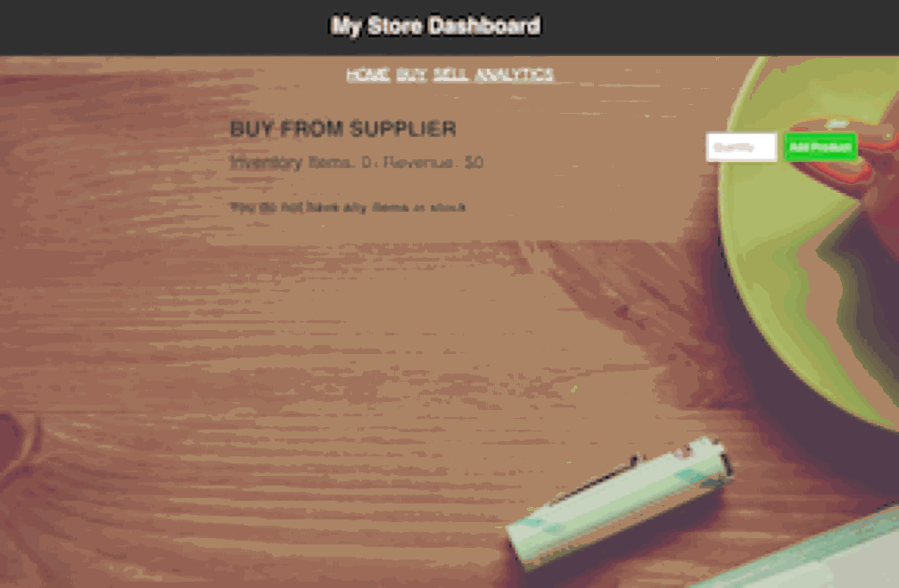
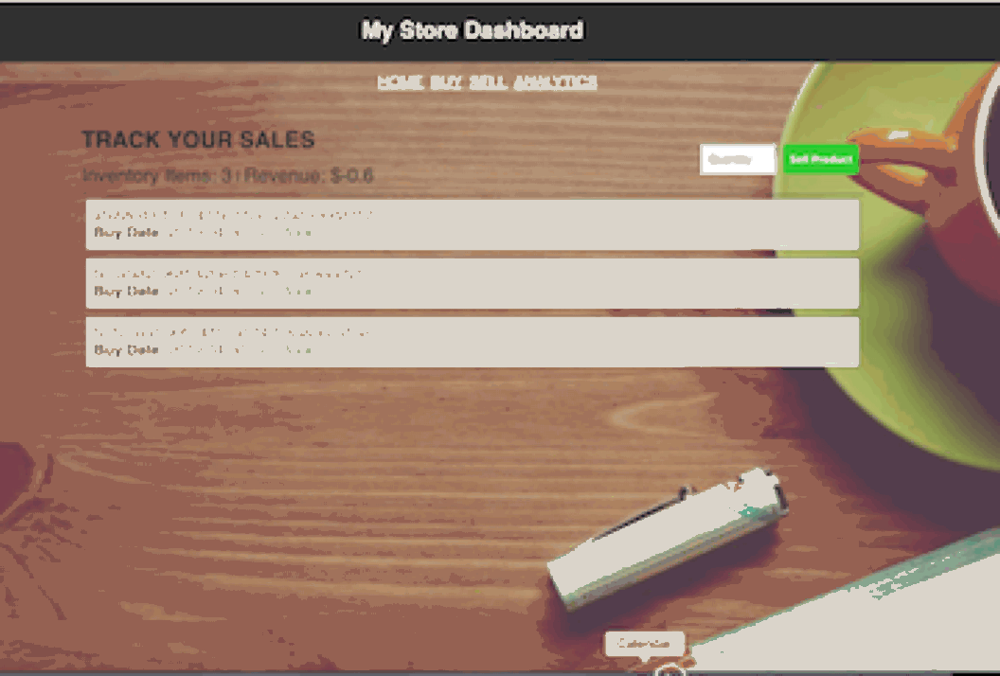

# React Book Keeping Interface

This is a simple react book keeping interface built with node.js, react, react-router, and scss.

## SET UP

1. Install Node v8.70 and NPM
 * https://docs.npmjs.com/downloading-and-installing-node-js-and-npm
```sh
node install
```

1. Install Dependencies via NPM
```sh
npm install
```

## RUN APPLICATION
1. `npm start` or `node .`

## INTERFACE / VIEWS
1. "Buy" view that records the purchase of products from a supplier

1. "Sell" view that records each time a product is sold



1. "Analylitics" view showing:

    * Number of expired Products and unexpired Products
    * Number of total sales
    * Net Revenue

## Improvements to make
* Pagination for the product items, right now it uses a none-intuitive simple scroll
* React props to make sure right vals are being passed
* Fix Responsive behavior @media breakpoints
* Run app in localStorageMode when there is no access to the DB
* Accesibility
* Stylistically differentiate between Buy and Sell View
```
